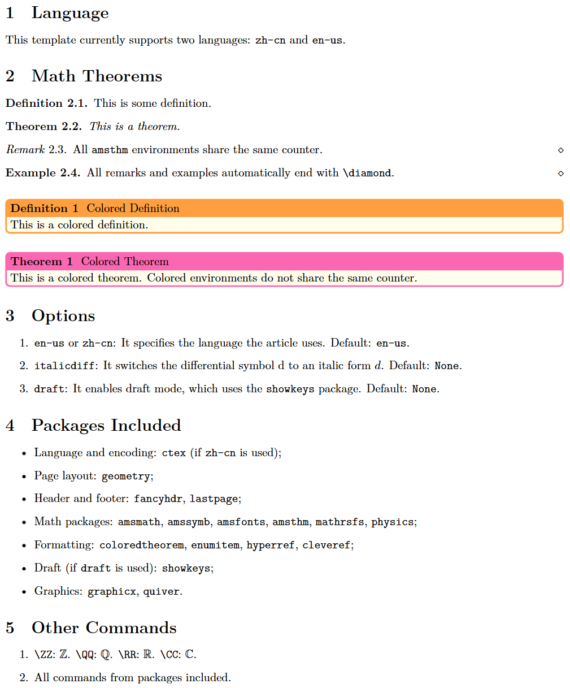

# YTM LaTeX Template

This is my own $\LaTeX$ template.

You are free to use, modify, and distribute this template under LPPL license.

If you're new to TeX, I recommend installing [TeX Live](https://tug.org/texlive/). If you prefer another alternative, the other major free distribution is [MiKTeX](https://miktex.org/).

You can use it in either English(`en-us`) or 简体中文(`zh-cn`). The following packages are automatically included:

- Language and encoding: `ctex` (if `zh-cn` is used);
- Page layout: `geometry`;
- Header and footer: `fancyhdr`, `lastpage`;
- Math packages: `amsmath`, `amssymb`, `amsfonts`, `amsthm`, `mathrsfs`, `physics`;
- Formatting: `coloredtheorem`, `enumitem`, `hyperref`, `cleveref`;
- Draft (if `draft` is used): `showkeys`;
- Graphics: `graphicx`, `quiver`.

